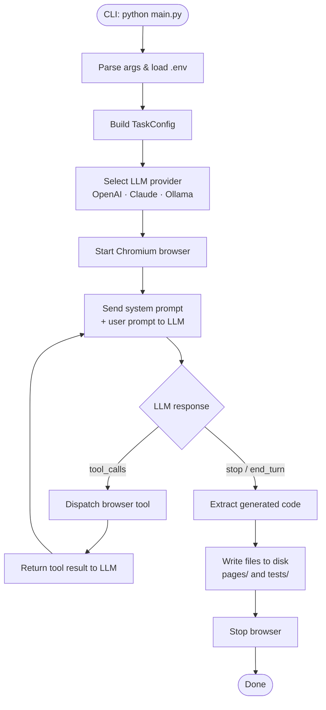
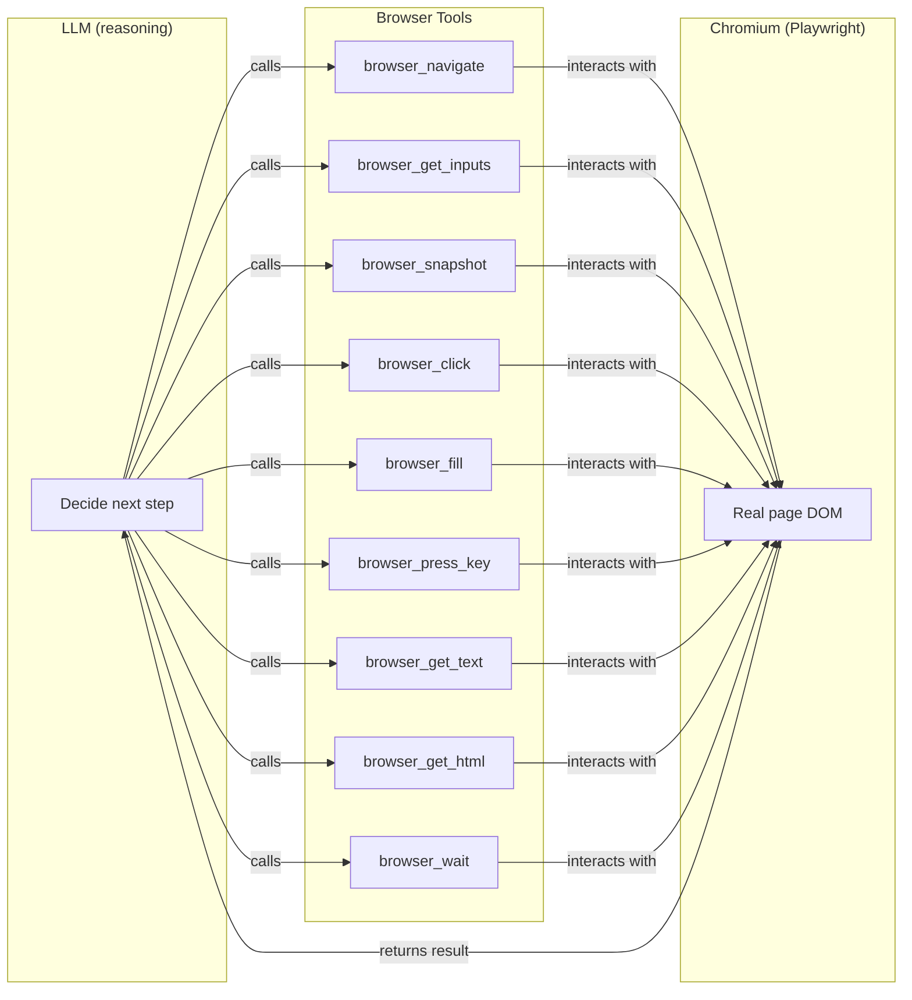
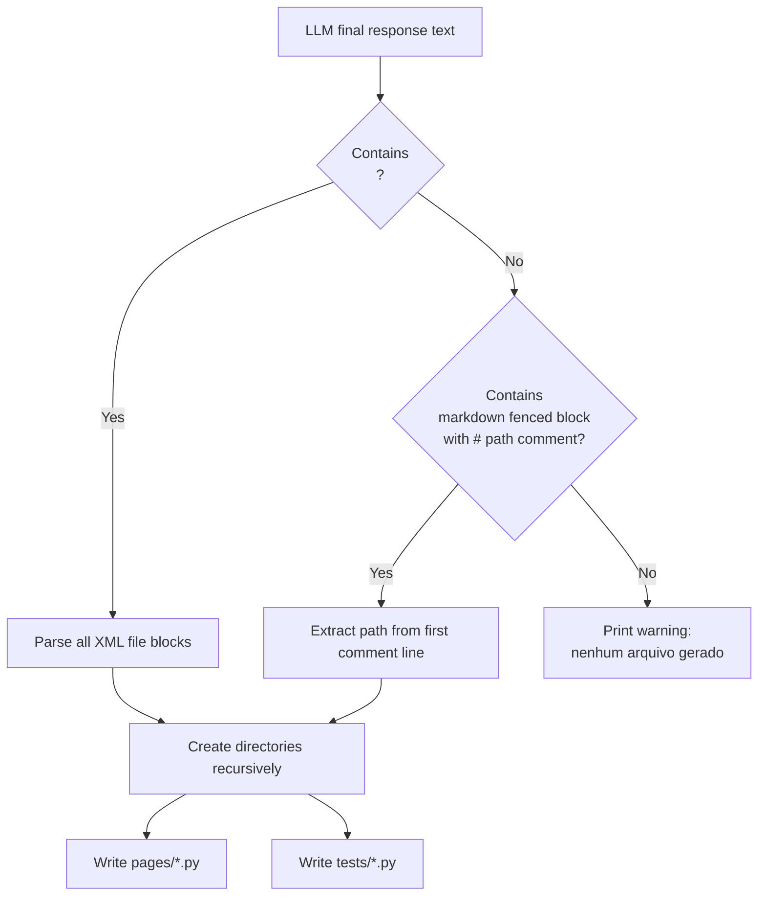
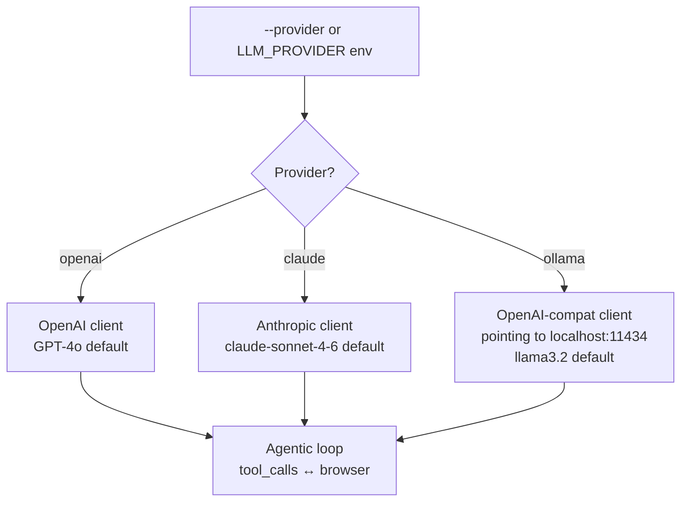

# MCP PlayWright

[](LICENSE)
[](https://www.python.org/)
[](https://playwright.dev/)

AI-powered browser automation framework that generates complete Playwright test suites — Page Object Model + pytest — from plain-text prompts. Supports OpenAI, Anthropic Claude and Ollama out of the box.

---

## Table of Contents

- [Overview](#overview)
- [How it works — flowcharts](#how-it-works--flowcharts)
- [Repository structure](#repository-structure)
- [Quick start](#quick-start)
- [CLI reference](#cli-reference)
- [LLM providers](#llm-providers)
- [Browser tools (agent capabilities)](#browser-tools-agent-capabilities)
- [Generated output](#generated-output)
- [Running generated tests](#running-generated-tests)
- [Advanced usage](#advanced-usage)
- [License](#license)

---

## Overview

Describe a user flow in natural language. The agent:

1. Opens a **real Chromium browser** (visible or headless)
2. Navigates to your application
3. Inspects the **live DOM** — field ids, names, labels, roles — before touching anything
4. Executes the flow step-by-step, taking accessibility snapshots after each action
5. Writes **Page Object Model classes** + **pytest test files** based on what it actually found

No manual selector hunting. No brittle CSS hardcoding.

---

## How it works — flowcharts

### 1 — Agent execution loop



---

### 2 — Browser interaction flow



---

### 3 — File generation flow



---

### 4 — LLM provider selection



---

## Repository structure

```
MCP_PlayWright/
└── agent_browser/
    ├── main.py              # CLI entry point — argparse + asyncio
    ├── conftest.py          # pytest fixture: config (session-scoped)
    ├── .env.example         # Template for environment variables
    ├── requirements.txt     # Python dependencies
    ├── agent/
    │   ├── browser.py       # Browser class — 9 async actions via Playwright
    │   ├── tools.py         # Tool schemas (OpenAI + Anthropic format) & dispatcher
    │   ├── prompts.py       # System prompt builder (login hint + extra context)
    │   ├── runner.py        # TaskConfig dataclass + agent loops per provider
    │   └── writer.py        # Parses LLM output and writes files to disk
    └── utils/
        └── config.py        # Config class — reads BASE_URL, LOGIN_USER, LOGIN_PASSWORD
```

---

## Quick start

```bash
cd agent_browser

# 1. Create and activate virtualenv
python -m venv .venv
.venv\Scripts\activate        # Windows
# source .venv/bin/activate   # Linux / macOS

# 2. Install dependencies
pip install -r requirements.txt
playwright install chromium

# 3. Configure
cp .env.example .env
# Edit .env with your app URL, credentials and API key
```

Minimal `.env`:

```env
BASE_URL=https://your-app/login
LOGIN_USER=admin
LOGIN_PASSWORD=secret

LLM_PROVIDER=openai
OPENAI_API_KEY=sk-...
```

Run the generator:

```bash
python main.py "Login, navigate to Auditoria > Lista de Auditorias and click Iniciar Auditoria"
```

The agent navigates your app, inspects the DOM, executes the flow, and writes `pages/` + `tests/` into the current directory.

---

## CLI reference

```
python main.py <PROMPT> [OPTIONS]
```

| Argument | Flag | Description |
|---|---|---|
| `PROMPT` | positional | Natural language description of the flow to automate |
| URL | `--url URL` | Base URL (overrides `BASE_URL` from `.env`) |
| User | `--user USER` | Login username (overrides `LOGIN_USER`) |
| Password | `--password PASS` | Login password (overrides `LOGIN_PASSWORD`) |
| Provider | `--provider {openai,claude,ollama}` | LLM provider (overrides `LLM_PROVIDER`) |
| Model | `--model MODEL` | Specific model name (overrides `LLM_MODEL`) |
| Headless | `--headless` | Run browser without visible window |
| Output | `--output DIR` / `-o DIR` | Directory to write generated files (default: `.`) |
| Context | `--context TEXT` / `-c TEXT` | Extra context about the site (routing, framework, quirks) |

### Examples

```bash
# Basic login flow (reads URL and credentials from .env)
python main.py "Login and navigate to dashboard"

# Override credentials inline
python main.py "Login and check audit list" \
  --url https://myapp.com/login \
  --user admin --password secret123

# Use Claude, headless, save to a custom folder
python main.py "Checkout flow" \
  --provider claude \
  --headless \
  --output ./generated

# Provide extra context to help the agent navigate
python main.py "Create a new report" \
  --context "After login the app redirects to /dashboard. Sidebar has 'Relatórios' entry. Uses React SPA."

# Use a local Ollama model
python main.py "Test login" \
  --provider ollama \
  --model llama3.2
```

---

## LLM providers

| `LLM_PROVIDER` | Default model | Required |
|---|---|---|
| `openai` (default) | `gpt-4o` | `OPENAI_API_KEY` |
| `claude` | `claude-sonnet-4-6` | `ANTHROPIC_API_KEY` |
| `ollama` | `llama3.2` | Ollama running locally; `OLLAMA_BASE_URL` (default `http://localhost:11434/v1`) |

Override the model for any provider:

```env
LLM_MODEL=gpt-4o-mini
```

```bash
python main.py "..." --provider claude --model claude-opus-4-8
```

---

## Browser tools (agent capabilities)

The agent has 9 browser tools available. The LLM decides which to call and when.

| Tool | Description |
|---|---|
| `browser_navigate` | Navigate to a URL, waits for `networkidle` |
| `browser_get_inputs` | List all visible `input`, `textarea`, `select` elements with real `id`, `name`, `type`, `placeholder`, `label` attributes |
| `browser_snapshot` | Return the accessibility tree (roles, names, states) — used after every action to understand current page state |
| `browser_click` | Click an element by selector; waits for `networkidle` afterwards |
| `browser_fill` | Fill a form field with a value; waits for element to be visible first |
| `browser_press_key` | Press a keyboard key (e.g. `Enter`, `Tab`, `Escape`) |
| `browser_get_text` | Return all visible text from `<body>` (up to 4 000 chars) |
| `browser_get_html` | Return inner HTML of a CSS selector (up to 6 000 chars) |
| `browser_wait` | Wait N milliseconds (useful for animations, dropdowns) |

> The agent is instructed to **always call `browser_get_inputs` before filling any field** — it never guesses selectors.

---

## Generated output

The agent produces files in the **Page Object Model** pattern:

```
pages/
└── login_page.py          # Page class with locators and actions
└── auditoria_page.py

tests/
└── test_login.py          # pytest test using the page objects
└── test_auditoria.py
```

### Page object example (auto-generated)

```python
# pages/login_page.py
from playwright.sync_api import Page
from utils.config import Config

class LoginPage:
    def __init__(self, page: Page, config: Config):
        self.page = page
        self.config = config

    def navigate(self):
        self.page.goto(self.config.base_url)

    def login(self):
        self.page.get_by_label("Usuário").fill(self.config.login_user)
        self.page.get_by_label("Senha").fill(self.config.login_password)
        self.page.get_by_role("button", name="Entrar", exact=True).click()
```

### Test example (auto-generated)

```python
# tests/test_login.py
from playwright.sync_api import Page
from utils.config import Config
from pages.login_page import LoginPage

def test_login(page: Page, config: Config):
    lp = LoginPage(page, config)
    lp.navigate()
    lp.login()
    page.wait_for_url("**/dashboard")
```

Locator priority enforced in the system prompt:

1. `get_by_role(exact=True)`
2. `get_by_label`
3. `get_by_text(exact=True)`
4. `.first` when there is ambiguity

---

## Running generated tests

```bash
# Review generated files first
cat pages/*.py
cat tests/*.py

# Run all tests
pytest

# Run with visible browser (headed mode)
pytest --headed

# Run specific test
pytest tests/test_login.py -v
```

> `pages/` and `tests/` are in `.gitignore`. Review the generated files and commit them once approved.

### pytest fixtures (conftest.py)

`conftest.py` provides a session-scoped `config` fixture that loads `.env`:

```python
@pytest.fixture(scope="session")
def config() -> Config:
    return Config()
```

Tests receive `page: Page` from `pytest-playwright` and `config: Config` from the above fixture.

---

## Advanced usage

### Extra context (`--context`)

Pass free-form text about your app to help the agent navigate without trial and error:

```bash
python main.py "Create a purchase order" \
  --context "Single-page React app. After login, goes to /home. PO form is under Menu > Compras > Nova O.C. Fields use custom Angular components."
```

### Custom output directory

```bash
python main.py "Onboarding flow" --output ./tests/e2e
```

### Environment file variables

| Variable | Required | Description |
|---|---|---|
| `BASE_URL` | Yes (for tests) | Application URL (e.g. `https://myapp.com/login`) |
| `LOGIN_USER` | Yes (for tests) | Login username |
| `LOGIN_PASSWORD` | Yes (for tests) | Login password |
| `LLM_PROVIDER` | No (default: `openai`) | `openai` \| `claude` \| `ollama` |
| `LLM_MODEL` | No | Override default model for the chosen provider |
| `OPENAI_API_KEY` | If using `openai` | OpenAI API key |
| `ANTHROPIC_API_KEY` | If using `claude` | Anthropic API key |
| `OLLAMA_BASE_URL` | If using `ollama` | Default: `http://localhost:11434/v1` |

---

## License

[MIT](LICENSE) © 2026 Guilherme Fabio Vieira
