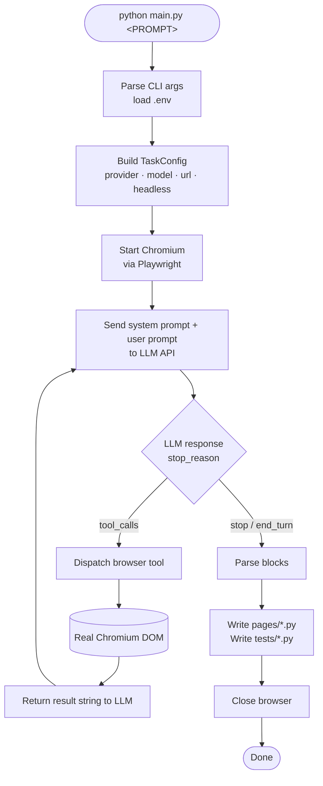
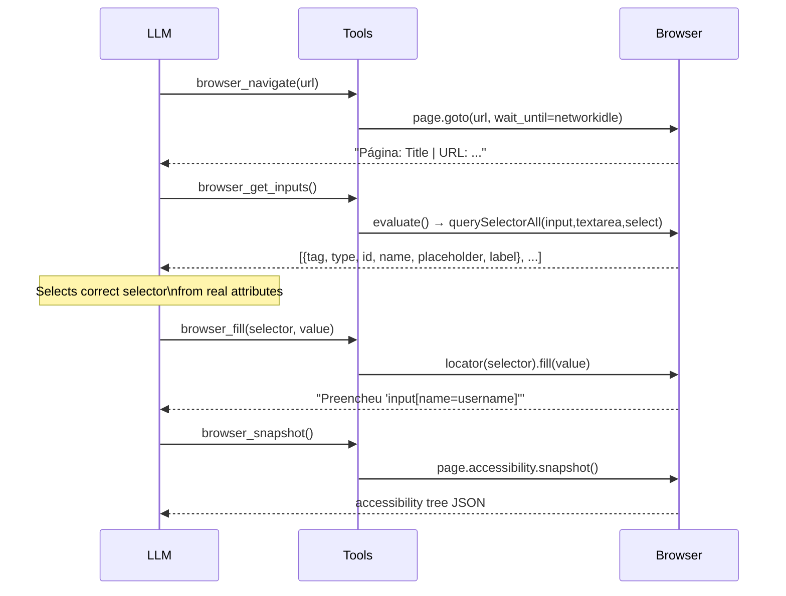

# agent_browser

AI-powered Playwright test generator. Describe a user flow in plain text — the agent opens a real browser, inspects the live DOM, executes the flow, and writes Page Object Model classes + pytest tests automatically.

---

## Flowchart — agent loop



---

## Flowchart — DOM inspection before fill



---

## Project structure

```
agent_browser/
├── main.py              # CLI entry point (argparse + asyncio)
├── conftest.py          # pytest fixture: config (session-scoped)
├── .env.example         # Template for environment variables
├── requirements.txt
├── agent/
│   ├── browser.py       # Browser class — 9 async actions
│   ├── tools.py         # Tool schemas (OpenAI + Anthropic) & dispatcher
│   ├── prompts.py       # System prompt builder
│   ├── runner.py        # TaskConfig + agent loops per provider
│   └── writer.py        # LLM output parser → writes files to disk
└── utils/
    └── config.py        # Reads BASE_URL, LOGIN_USER, LOGIN_PASSWORD from .env
```

---

## Setup

```bash
python -m venv .venv
.venv\Scripts\activate        # Windows
# source .venv/bin/activate   # Linux / macOS

pip install -r requirements.txt
playwright install chromium
```

Copy `.env.example` to `.env`:

```env
BASE_URL=https://your-app/login
LOGIN_USER=admin
LOGIN_PASSWORD=secret

LLM_PROVIDER=openai           # openai | claude | ollama
OPENAI_API_KEY=sk-...
# ANTHROPIC_API_KEY=sk-ant-...
# OLLAMA_BASE_URL=http://localhost:11434/v1
# LLM_MODEL=gpt-4o-mini
```

---

## CLI options

| Argument | Description |
|---|---|
| `PROMPT` (positional) | Natural language description of the flow |
| `--url URL` | Base URL (overrides `BASE_URL`) |
| `--user USER` | Login user (overrides `LOGIN_USER`) |
| `--password PASS` | Login password (overrides `LOGIN_PASSWORD`) |
| `--provider {openai,claude,ollama}` | LLM provider (overrides `LLM_PROVIDER`) |
| `--model MODEL` | Model name (overrides `LLM_MODEL`) |
| `--headless` | Run browser without visible window |
| `--output DIR` / `-o DIR` | Output directory (default: `.`) |
| `--context TEXT` / `-c TEXT` | Extra context about the site |

---

## Browser tools

| Tool | What it does |
|---|---|
| `browser_navigate` | `page.goto(url, wait_until="networkidle")` |
| `browser_get_inputs` | Lists all visible fields with real `id/name/type/placeholder/label` |
| `browser_snapshot` | Accessibility tree — roles, names, states (up to 8 000 chars) |
| `browser_click` | `locator.click()` then waits `networkidle` |
| `browser_fill` | Waits for visibility, then `locator.fill(value)` |
| `browser_press_key` | `keyboard.press(key)` then waits `networkidle` |
| `browser_get_text` | `inner_text("body")` — up to 4 000 chars |
| `browser_get_html` | `inner_html(selector)` — up to 6 000 chars |
| `browser_wait` | `asyncio.sleep(ms / 1000)` |

---

## LLM providers

| `LLM_PROVIDER` | Default model | Required |
|---|---|---|
| `openai` | `gpt-4o` | `OPENAI_API_KEY` |
| `claude` | `claude-sonnet-4-6` | `ANTHROPIC_API_KEY` |
| `ollama` | `llama3.2` | Ollama running locally |

---

## Running generated tests

After the agent writes `pages/` and `tests/`:

```bash
# Run everything
pytest

# Headed (visible browser)
pytest --headed

# Single test
pytest tests/test_login.py -v
```

The `conftest.py` provides a session-scoped `config` fixture that loads `.env`.
`page: Page` comes from `pytest-playwright`; `config: Config` comes from `conftest.py`.

> `pages/` and `tests/` are in `.gitignore` — review then commit.
